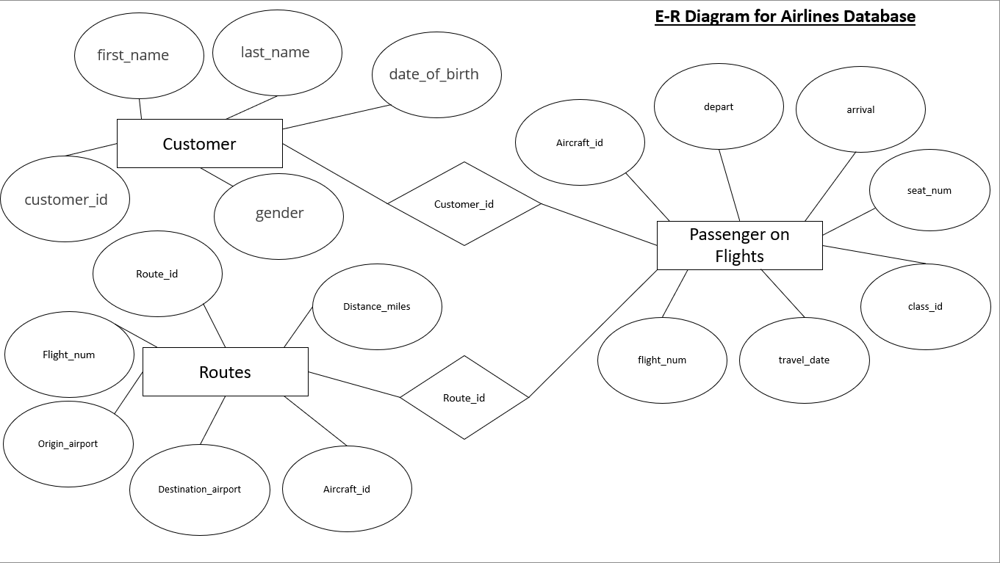

# ✈️ Air Cargo / Airlines SQL Analysis



## 🔍 Objective
Design and implement a relational airline database for analyzing regular customers, busiest routes, and ticket revenue by class and brand. The project demonstrates database design, SQL querying, performance tuning, stored program units, and airline business analytics.

## 🧱 Schema Overview
The system is built around four core entities:

- **Customer** – personal details of passengers
- **Routes** – origin, destination, and distance information
- **Passengers_on_flights** – travel and seating records
- **Ticket_details** – ticket purchase and pricing information

The ER diagram defines relationships between customers, flights, routes and ticket transactions.

## 🗂 Dataset
| Table / File | Description |
|--------------|-------------|
| customer.csv | Customer demographic details |
| routes.csv | Flight routes and distances |
| passengers_on_flights.csv | Travel records for passengers |
| ticket_details.csv | Ticket purchase and pricing information |
| AIRLINES_PROJECT_AYUSH_VISHWAKARMA.csv | Consolidated dataset (optional extract) |

## 🛠 Tools & SQL Concepts Used
- RDBMS: MySQL-compatible SQL
- DDL, DML, DCL, TCL
- Constraints, joins, grouping, window functions
- View, stored procedure, stored function, cursor
- Indexing & execution plan
- ROLLUP & IF logic for analytical reporting

## 🧩 Database Logic Highlights

### ✔ Route Details Table (with constraints)
- `ROUTE_ID` — Primary Key + Unique
- `FLIGHT_NUM` — CHECK constraint `FLIGHT_NUM > 0`
- `DISTANCE_MILES` — CHECK constraint `DISTANCE_MILES > 0`

### ✔ Customer & Revenue Insights
- Passengers traveling on routes **01–25**
- **Passenger count and total revenue** for **Business class**
- **Regular customers** who both registered and booked
- **Brand-wise** customer lookup (e.g., Emirates)
- **Economy Plus passengers** using `GROUP BY` + `HAVING`
- `IF` statement check to validate whether revenue **exceeded 10000**

### ✔ Performance & Advanced Queries
- **Execution plan** and **indexing** applied for queries on `route_id = 4`
- **Maximum ticket price per class** using a **window function**
- **ROLLUP** to compute **total ticket revenue per customer across aircraft IDs**

### ✔ View, Procedure, Function & Cursor
- **View:** Business class customers + airline brand
- **Stored Procedures:**
  - Passenger details for a *dynamic* range of routes (with missing-table error handling)
  - All routes with **distance > 2000 miles**
  - Distance category:
    - `SDT` → 0–2000 miles
    - `IDT` → 2000–6500 miles
    - `LDT` → >6500 miles
- **Stored Function:** Complimentary services flag  
  - Business / Economy Plus → Yes  
  - Other classes → No  
  - Used inside SP to return `p_date`, `customer_id`, `class_id`, and complimentary service flag
- **Cursor:** Fetch the first customer whose **last name ends with _Scott_**

## 📈 Business Questions Answered
- Who are the **regular and high-value customers**?
- Which **routes are busiest** and potentially need additional aircraft?
- Which **travel classes and brands** generate **maximum revenue**?
- What **pricing patterns** exist by class and route?
- Where can **customer experience improvements** drive repeat bookings?

## 🚀 Business Impact
This solution supports data-backed decision-making by enabling:
- Targeted offers to **frequent flyers**
- Capacity planning for **high-traffic routes**
- Pricing improvements based on **revenue by class/brand**
- Better customer satisfaction through **complimentary service eligibility**
- Strong analytical foundation for **airline operations and marketing strategy**

## ▶️ How to Execute
1. Create database (e.g., `air_cargo_db`)
2. Import CSV datasets into respective tables
3. Run `AIRLINES_PROJECT_AYUSH_VISHWAKARMA.sql`
4. Execute analytical queries sequentially to view results
5. Test stored procedures, view, function, cursor and performance improvements

## 📁 Repository Contents

```text
📦 Air_Cargo_SQL_Analysis
├── 📂 Datasets
│   ├── customer.csv
│   ├── routes.csv
│   ├── passengers_on_flights.csv
│   ├── ticket_details.csv
│   └── AIRLINES_PROJECT_AYUSH_VISHWAKARMA.csv
├── 📂 Documentation
│   ├── 1697127212_cep2aircargoanalysisproblemstatement.docx
│   └── ER_DIAGRAM_AIRLINE_DATABASE.png
│   └── AYUSH_VISHWAKARMA_AIRLINES_PROJECT_ANSWERS.pdf
├── 📂 SQL_Scripts
│   └── AIRLINES_PROJECT_AYUSH_VISHWAKARMA.sql
└── README.md
```
##👨‍💻 Author
Ayush Vishwakarma — Data Analyst
GitHub Portfolio: https://github.com/ayush-vkarma
LinkedIn: https://www.linkedin.com/in/ayush-d-vishwakarma
